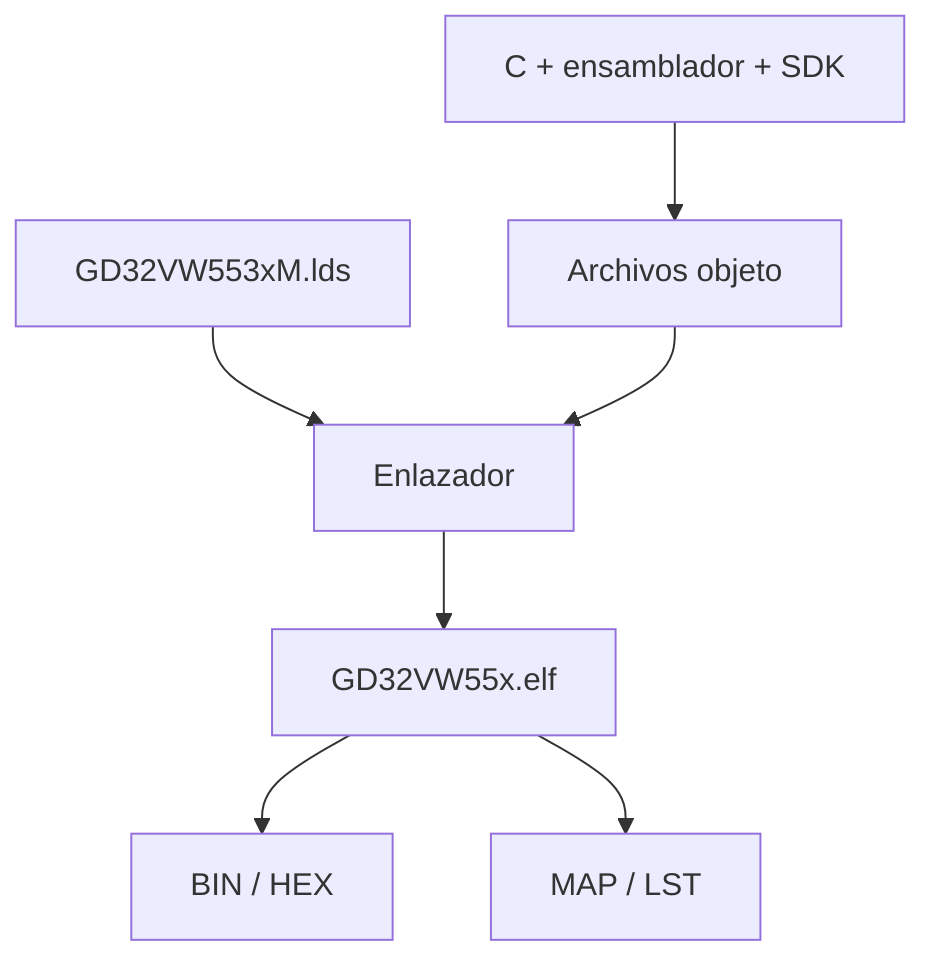
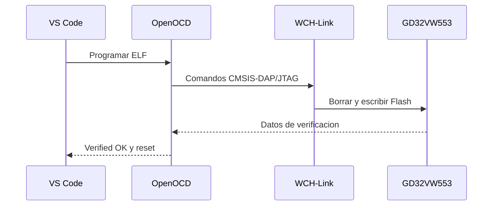

# 2. De los fuentes a la memoria Flash

## Que ocurre al compilar



### 1. Configuracion

CMake lee `CMakeLists.txt`, el preset y el toolchain. Comprueba el SDK, localiza
los fuentes y genera las reglas Ninja en `build/debug`.

### 2. Compilacion

Cada `.c` y `.S` se transforma en un objeto RISC-V. Los flags principales son:

| Flag | Significado |
| --- | --- |
| `-march=rv32imafdc` | RV32 con enteros, multiplicacion, atomicas, flotante y comprimidas |
| `-mabi=ilp32d` | ABI de 32 bits con soporte de doble precision |
| `-mcmodel=medany` | Modelo de direcciones adecuado para firmware |
| `-Og -g3` | Depuracion legible en configuracion Debug |
| `-ffunction-sections` | Una seccion por funcion para eliminar codigo no usado |

### 3. Enlace

El linker script coloca vectores, codigo, constantes, datos, pila y heap en las
regiones correctas. `--gc-sections` descarta secciones sin referencias.

### 4. Postproceso

| Archivo | Uso |
| --- | --- |
| `.elf` | Simbolos, depuracion y programacion con OpenOCD |
| `.hex` | Imagen Intel HEX |
| `.bin` | Imagen binaria plana |
| `.map` | Direcciones y ocupacion de memoria |
| `.lst` | Desensamblado; permite localizar `c.unimp` |

## Tareas de VS Code

| Tarea | Accion |
| --- | --- |
| `1. Verificar entorno GD32` | Valida herramientas y rutas |
| `2. Configurar CMake (Debug)` | Genera `build/debug` |
| `3. Compilar GD32 (Debug)` | Construye y genera artefactos |
| `4. Programar GD32 (Debug)` | Escribe y verifica la Flash |
| `5. Compilar y programar GD32` | Ejecuta 2, 3 y 4 en secuencia |
| `6. Preparar depuracion` | Genera el `launch.json` local |

Para el uso diario basta con la tarea 5.

## Programacion mediante OpenOCD



Una programacion correcta contiene:

```text
Programming Finished
Verified OK
Resetting Target
```

La advertencia que estima 4096 KB de Flash es conocida en esta combinacion de
target OpenOCD. Si finaliza con `Verified OK`, no constituye un fallo de esta
practica.

## Comprobacion final

Tras el reset, observe tres destellos cortos seguidos de una pausa. El patron
demuestra simultaneamente que:

1. el ELF fue programado;
2. la CPU arranco;
3. se genero la excepcion;
4. el manejador recupero la ejecucion;
5. SysTimer y el lazo principal siguen activos.
