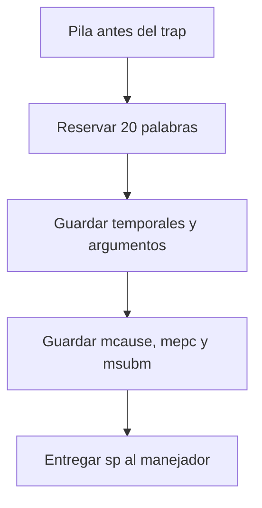

# 3. Fundamentos: traps, contexto y recuperacion

## 3.1 Trap: el concepto general

**Trap** es el nombre general para una transferencia de control causada por una
excepcion o una interrupcion.

| Propiedad | Excepcion | Interrupcion |
| --- | --- | --- |
| Relacion con el codigo | La causa la instruccion actual | Llega desde otro bloque de hardware |
| Tiempo | Sincrona | Asincrona |
| Ejemplo | Instruccion ilegal | Comparacion de SysTimer |
| Pregunta central | ¿Que instruccion fallo? | ¿Que periferico solicita servicio? |
| Retorno | Puede requerir corregir `mepc` | Normalmente reanuda el flujo interrumpido |

Este ejercicio mantiene activas ambas rutas: SysTimer genera interrupciones de
1 ms y `c.unimp` genera una excepcion. El SDK las conduce por entradas
diferentes.

## 3.2 Los CSR como registro del acontecimiento

Los **Control and Status Registers** contienen el estado privilegiado de la
CPU. Al ocurrir el trap, el hardware proporciona al software la informacion
minima para diagnosticarlo.

### `mcause`

- El bit mas significativo distingue interrupcion de excepcion.
- Los bits inferiores contienen el codigo de causa.
- En este ejercicio: `mcause & 0xFFF = 2`.

### `mepc`

Contiene la direccion relacionada con el punto donde se produjo el trap. Para
la instruccion ilegal apunta a `c.unimp`. Retornar sin cambiarlo ejecutaria la
misma instruccion y produciria nuevamente la misma excepcion.

### `mtval`

Contiene informacion adicional definida para la causa: una direccion invalida,
la codificacion de una instruccion o cero. Su valor puede depender de la
implementacion del nucleo.

### `mstatus`

Conserva, entre otros campos, el estado de habilitacion de interrupciones y el
modo previo. El hardware y `mret` coordinan su actualizacion.

## 3.3 Que guarda `entry.S`

La entrada del SDK reserva 20 palabras de 32 bits y guarda registros que una
funcion C puede modificar. Despues almacena `mcause`, `mepc` y `msubm`.



Mapa simplificado del marco usado por este proyecto:

| Indice | Offset RV32 | Contenido |
| ---: | ---: | --- |
| 0 | 0 | `ra` |
| 1 | 4 | `tp` |
| 2–4 | 8–16 | `t0–t2` |
| 5–10 | 20–40 | `a0–a5` |
| 11 | 44 | `mcause` |
| 12 | 48 | `mepc` |
| 13 | 52 | `msubm` |
| 14–15 | 56–60 | `a6–a7` |
| 16–19 | 64–76 | `t3–t6` |

El argumento `sp` del manejador apunta al indice 0. Por eso
`exception_frame_t` debe respetar exactamente este orden.

## 3.4 Convencion de llamada: `a0` y `a1`

Antes de llamar `core_exception_handler`, `entry.S` prepara:

| Registro ABI | Valor |
| --- | --- |
| `a0` | `mcause` |
| `a1` | puntero al marco guardado en la pila |

`core_exception_handler` extrae el codigo y busca el manejador previamente
registrado con `Exception_Register_EXC(2, ...)`. Finalmente llama nuestra
funcion con la misma firma.

## 3.5 Por que se modifica el marco y no solo el CSR

El orden de salida es:


Si el manejador escribiera un nuevo valor directamente en el CSR `mepc`, la
rutina de salida lo sobrescribiria con el valor antiguo almacenado en la pila.
Modificar `frame->mepc` hace que la restauracion use el valor corregido.

## 3.6 Longitud variable de instrucciones

La extension RISC-V C permite instrucciones comprimidas de 16 bits. La regla
basica es:

```text
bits [1:0] distintos de 11  -> 16 bits -> avanzar 2 bytes
bits [1:0] iguales a 11     -> 32 bits o mas -> avanzar al menos 4 bytes
```

`c.unimp` se codifica como `0x0000`; sus bits inferiores son `00`, por lo que
el manejador calcula una longitud de 2 bytes. Avanzar 4 bytes omitiria tambien
la instruccion siguiente.

## 3.7 Recuperarse no significa ignorar

La recuperacion se autoriza solo si:

```text
causa = 2
AND g_test_armed = 1
AND longitud = 2
```

Esta triple condicion convierte el trap en una prueba delimitada. Una causa
desconocida marca `g_unexpected_exception`; no se intenta ocultarla.

## 3.8 `volatile` y observabilidad

Las variables de evidencia son `volatile` porque cambian en un contexto de
excepcion o se observan desde el depurador. Esto obliga al compilador a realizar
los accesos a memoria visibles. `volatile` no hace atomica una operacion ni
reemplaza mecanismos de sincronizacion.

## Preguntas de comprension

1. ¿Que diferencia temporal existe entre SysTimer y `c.unimp`?
2. ¿Por que `g_test_completed=1` demuestra que `mret` funciono?
3. ¿Que ocurriria si no se incrementara `frame->mepc`?
4. ¿Por que incrementar siempre cuatro bytes seria incorrecto?
5. ¿Que representa `sp` dentro del manejador?
6. ¿Que funcion cumple `Exception_Register_EXC`?
7. ¿Por que se comprueba `g_test_armed`?
8. ¿Que limitacion tiene `volatile`?
9. ¿Que politica usaria un dispositivo medico ante una excepcion desconocida?
10. ¿Como se relaciona este flujo con HardFault en ARM o una señal en Linux?

## Retos opcionales

- Localice la instruccion `0x0000` en `GD32VW55x.lst`.
- Compare la direccion del listado con `g_last_mepc`.
- Proponga un contador persistente de fallos antes de reiniciar.
- Diseñe una politica de estado seguro que no dependa del LED.
