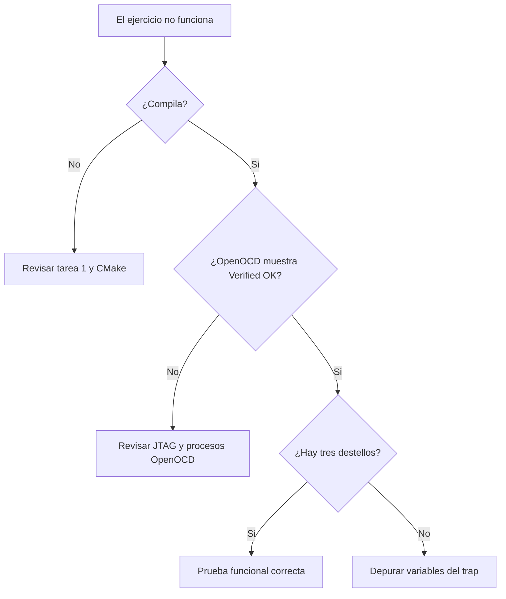

# 5. Diagnostico y solucion de problemas

## Arbol de decision



## No aparecen las tareas

**Causa probable:** se abrio la carpeta padre o VS Code esta en modo
restringido.

**Solucion:** abra directamente `08_RISCV_Exception_Recovery`, confie en la
carpeta y confirme que `.vscode/tasks.json` existe.

## La verificacion no encuentra GCC o GDB

`NUCLEI_TOOLCHAIN_DIR` debe terminar en la carpeta `bin` que contiene:

```text
riscv-nuclei-elf-gcc.exe
riscv-nuclei-elf-gdb.exe
riscv-nuclei-elf-objdump.exe
```

Corrija solamente `tools/local_config.ps1`.

## CMake dice que falta un archivo del SDK

`GD32_SDK_ROOT` debe apuntar a la raiz de
`GD32VW55x_Firmware_Library_V1.6.0`. Desde ella deben existir:

```text
Firmware/GD32VW55x_standard_peripheral/system_gd32vw55x.c
Firmware/RISCV/env_Eclipse/GD32VW553xM.lds
Utilities/gd32vw553h_eval.c
```

Si cambio una ruta despues de configurar, elimine `build/` desde el explorador
de archivos y ejecute nuevamente la tarea 5.

## Ninja indica “no work to do”

No es un error. Significa que ningun fuente cambio desde la compilacion
anterior. La tarea de programacion puede continuar usando el ELF existente.

## OpenOCD no encuentra el depurador

- Revise el cable USB de datos.
- Compruebe alimentacion y conexiones JTAG.
- Cierre GD32 All In One Programmer y otras sesiones de depuracion.
- Desconecte y conecte nuevamente WCH-Link.

## El puerto 3333 esta ocupado

Una sesion anterior de OpenOCD sigue activa. Detenga la depuracion, cierre sus
terminales y vuelva a iniciar. No ejecute simultaneamente la tarea de programar
y una sesion de debug.

## El LED muestra parpadeo rapido

Es el indicador de error. Revise en Watch, en este orden:

| Variable | Valor correcto | Si no coincide |
| --- | ---: | --- |
| `g_exception_count` | 1 | El handler no se registro o se repitio |
| `g_last_mcause & 0xFFF` | 2 | Ocurrio otra excepcion |
| `g_last_instruction` | `0x0000` | `mepc` no apunta a `c.unimp` |
| `g_instruction_length` | 2 | Se interpreto mal la longitud |
| `g_recovery_count` | 1 | No se autorizo la recuperacion |
| `g_test_completed` | 1 | No se regreso correctamente a `main` |
| `g_unexpected_exception` | 0 | Fallo una condicion de seguridad |

## Se repite infinitamente la excepcion

Esto ocurre si el valor restaurado de `mepc` sigue apuntando a `c.unimp`.
Compruebe que se modifica `frame->mepc`, no solo una variable local ni el CSR
temporal. `entry.S` restaura el CSR desde la pila antes de `mret`.

## El breakpoint no se detiene en el manejador

- Compile en Debug, no Release.
- Coloque el breakpoint en una instruccion ejecutable dentro de la funcion.
- Use `Run > Start Debugging` si la tecla F5 tiene otra funcion.
- Confirme que la configuracion seleccionada es la del GD32VW553.

## Watch muestra “optimized out”

Verifique que se construyo con el preset Debug (`-Og -g3`). Las variables
globales `volatile` deben permanecer observables; algunas variables locales
pueden reutilizar registros y no estar disponibles en todos los puntos.

## Git muestra avisos LF/CRLF

Son advertencias de finales de linea en Windows. No indican corrupcion ni fallo
de compilacion. Antes de publicar confirme que no se incluyan `build/`,
`tools/local_config.ps1` ni `.vscode/launch.json`.

## Diagnosticos falsos de IntelliSense

Si el proyecto genera correctamente `GD32VW55x.elf`, pero la pestaña
**Problems** muestra mensajes como estos:

- `cannot open source file "stdint.h"`;
- `cannot open source file "gd32vw55x.h"`;
- `expected declaration specifiers`;
- `expected '}' at end of input`;

el firmware no necesariamente esta mal. Los dos ultimos mensajes pueden ser
errores en cascada producidos porque IntelliSense no encontro los encabezados.

Este repositorio exporta `build/debug/compile_commands.json` durante la
configuracion de CMake. El archivo `.vscode/settings.json` indica a la extension
C/C++ que use esa base de datos, que contiene el compilador, las definiciones y
las rutas reales del SDK.

Para refrescar el analisis:

1. ejecute la tarea **2. Configurar CMake (Debug)**;
2. ejecute **3. Compilar GD32 (Debug)**;
3. abra la paleta de comandos de VS Code;
4. seleccione **C/C++: Reset IntelliSense Database**;
5. seleccione **Developer: Reload Window** si los mensajes antiguos siguen
   visibles.

La tarea de compilacion no usa un `problemMatcher`: un fallo real sigue
deteniendo la tarea mediante el codigo de salida de CMake/Ninja, pero los
diagnosticos antiguos de la pestaña **Problems** ya no bloquean el inicio de la
depuracion.
