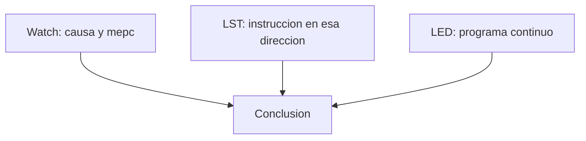

# 6. Practica guiada de clase

## Titulo

**Del fallo al diagnostico: recuperacion de una excepcion RISC-V**

## Duracion sugerida

90 minutos.

## Situacion problema

Un sistema embebido encuentra una instruccion que su CPU no reconoce. No hay
pantalla ni sistema operativo que muestre un mensaje. ¿Como puede el firmware
determinar que ocurrio y demostrar que recupero el control?

## Objetivos de la practica

1. Observar una excepcion real en hardware.
2. Relacionar causa, direccion e instruccion.
3. Reconstruir el recorrido por la pila.
4. Recuperar la ejecucion modificando el retorno.
5. Sustentar el resultado con evidencias verificables.

## Conocimientos previos

- Registros y contador de programa.
- Pila y llamadas a funciones.
- Representacion hexadecimal.
- Compilacion, enlace y archivo ELF.
- Concepto basico de interrupcion.

## Secuencia de la sesion

| Tiempo | Etapa | Actividad |
| ---: | --- | --- |
| 10 min | Fenomeno | Observar los tres destellos y formular hipotesis |
| 15 min | Modelo | Explicar trap, CSR y marco de pila |
| 15 min | Construccion | Compilar, programar y localizar `c.unimp` |
| 30 min | Observacion | Recorrer cuatro breakpoints y completar la tabla |
| 10 min | Analisis | Comparar `mepc`, listado y longitud |
| 10 min | Cierre | Presentar evidencia y responder pregunta de transferencia |

## Parte A — Prediccion

Antes de depurar, responda:

1. Si el procesador retorna a la misma instruccion, ¿que espera observar?
2. ¿Cuantos bytes cree que debe avanzar el PC?
3. ¿Que registro deberia contener la direccion del fallo?
4. ¿Que valor espera encontrar como causa?

No cambie las respuestas despues de medir; compare prediccion y evidencia.

## Parte B — Verificacion funcional

1. Ejecute la tarea 1.
2. Ejecute la tarea 5.
3. Observe PC13 durante diez segundos.
4. Registre el patron y explique que significa.

**Criterio:** tres pulsos cortos y pausa indican que la aplicacion alcanzo el
lazo posterior a la excepcion.

## Parte C — Recorrido con depurador

Siga [4_DEBUGGING.md](4_DEBUGGING.md) y complete:

| Momento | Variable o elemento | Valor observado | Interpretacion |
| --- | --- | --- | --- |
| Antes | `g_test_armed` | | |
| Trap | `g_last_mcause & 0xFFF` | | |
| Trap | `g_last_mepc` | | |
| Trap | `g_last_instruction` | | |
| Trap | `g_instruction_length` | | |
| Correccion | `frame->mepc` antes | | |
| Correccion | `frame->mepc` despues | | |
| Retorno | `g_test_completed` | | |
| Retorno | `g_unexpected_exception` | | |

## Parte D — Triangulacion de evidencia

La conclusion solo es valida si coinciden tres fuentes:

- Watch demuestra que detecto el nucleo.
- El listado demuestra que instruccion habia en esa direccion.
- El LED demuestra que el sistema continuo trabajando.

## Parte E — Analisis

Responda con sus propias palabras:

1. ¿Por que el fallo es sincrono?
2. ¿Por que el marco debe conservar el orden definido por el SDK?
3. ¿Por que se modifica `frame->mepc`?
4. ¿Que riesgo tendria omitir `g_test_armed`?
5. ¿Que cambiaria para una instruccion ilegal de 32 bits?

## Producto entregable

Un informe breve con:

- portada e identificacion de placa;
- diagrama del recorrido del trap;
- tabla de observaciones completa;
- cuatro capturas descritas;
- respuesta a las cinco preguntas;
- una conclusion de maximo 150 palabras.

## Rubrica sugerida

| Criterio | Peso |
| --- | ---: |
| Compilacion y ejecucion reproducible | 15% |
| Identificacion correcta de los CSR | 20% |
| Explicacion del marco y `mepc + 2` | 25% |
| Evidencias de depuracion interpretadas | 25% |
| Claridad, orden y conclusion | 15% |

## Pregunta de transferencia

> Si este mecanismo protegiera un sistema de riego, un equipo medico o un
> controlador industrial, ¿seria correcto continuar siempre? Proponga una
> politica de respuesta y justifiquela.
