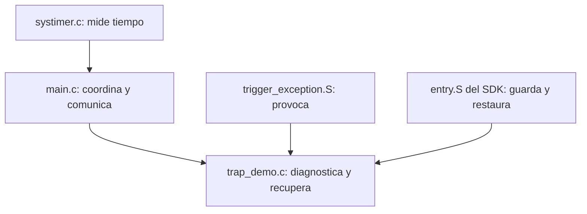
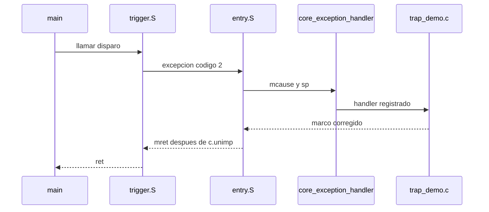

# 7. Recorrido del codigo

## Responsabilidades



## `Src/trigger_exception.S`

La funcion contiene dos acciones:

```asm
trigger_illegal_instruction:
    .hword 0x0000
    ret
```

`.hword 0x0000` inserta exactamente 16 bits. Esa codificacion esta reservada
como instruccion imposible. `ret` es la instruccion valida a la que debe llegar
la CPU despues de la recuperacion.

## `trap_demo_init()`

Registra la direccion del manejador para el codigo 2:

```c
Exception_Register_EXC(
    RISCV_EXC_ILLEGAL_INSTRUCTION,
    (unsigned long)illegal_instruction_handler
);
```

El registro evita modificar `entry.S` o reemplazar el manejador comun del SDK.

## `exception_frame_t`

No es una estructura arbitraria. Describe byte por byte la memoria que
`SAVE_CONTEXT` y `SAVE_CSR_CONTEXT` construyen en la pila. El campo `mepc`
queda en la palabra 12.

Una diferencia de orden o tamaño haria que `frame->mepc` apuntara a otro dato y
podria corromper el retorno.

## `instruction_length_at()`

Lee el primer halfword de la instruccion y aplica la regla de bits `[1:0]`:

```c
return ((first_halfword & 0x3U) == 0x3U) ? 4U : 2U;
```

Para `0x0000`, el resultado es 2.

## `illegal_instruction_handler()`

La funcion realiza cinco etapas:

1. convierte `sp` en `exception_frame_t *`;
2. captura causa, direccion, valor auxiliar e instruccion;
3. calcula la longitud;
4. valida que el trap sea exactamente el esperado;
5. cambia el retorno o marca un error.

La condicion de aceptacion es deliberadamente restrictiva:

```c
if ((exception_code == RISCV_EXC_ILLEGAL_INSTRUCTION) &&
    (g_test_armed != 0U) &&
    (instruction_length == 2U)) {
    frame->mepc += instruction_length;
}
```

## `main()`

El orden es significativo:

```c
led_init();
systimer_init_1ms();
trap_demo_init();
g_test_armed = 1U;
trigger_illegal_instruction();
g_test_completed = 1U;
```

- El LED se prepara como evidencia observable.
- SysTimer permite patrones no bloqueantes.
- El manejador se registra antes del disparo.
- La bandera limita la recuperacion a una prueba.
- `g_test_completed` solo se ejecuta despues del retorno exitoso.

## Patrones del LED

`success_pattern_update()` genera tres pulsos sin bloquear la CPU. El lazo
principal sigue incrementando `g_background_iterations`, demostrando que el
sistema no quedo detenido.

`error_pattern_update()` produce un parpadeo rapido cuando la evidencia no
coincide. El LED no diagnostica la causa exacta; indica que debe abrirse el
depurador.

## `systimer.c`

La ISR de 1 ms solo:

1. limpia el pendiente;
2. incrementa `g_systimer_ticks`.

Mantener la ISR corta reduce latencia y evita mezclar temporizacion con logica
de aplicacion.

## Del fuente al SDK


