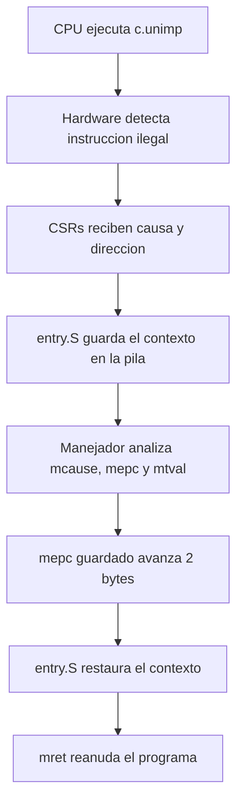
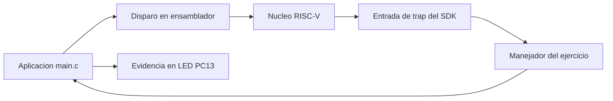

# Excepciones RISC-V y recuperacion controlada en GD32VW553


**Autora:** Laura Daniela Barragan Silva  
**Coleccion:** Estructuras Computacionales con GD32  
**Placa:** GD32VW553HMQ6/HMQ7  
**Interfaz de depuracion:** WCH-Link/CMSIS-DAP mediante JTAG

## La pregunta del ejercicio

> ¿Como puede un procesador detectar una instruccion imposible, conservar el
> estado del programa, diagnosticar la causa y continuar de manera controlada?

El programa ejecuta deliberadamente `c.unimp`, una instruccion comprimida
RISC-V reservada. La CPU genera una excepcion, guarda informacion de diagnostico
y transfiere el control al manejador. El manejador identifica el problema,
avanza la direccion de retorno dos bytes y permite que el programa continue.

No se oculta el fallo: se **captura, interpreta, corrige y verifica**.

## Que aprenderas

Al finalizar podras:

- diferenciar excepciones sincronas e interrupciones asincronas;
- interpretar los CSR `mcause`, `mepc` y `mtval`;
- reconocer el papel del vector de traps y del codigo de entrada `entry.S`;
- entender por que el contexto de la CPU se guarda en la pila;
- identificar instrucciones RISC-V de 16 y 32 bits;
- modificar de forma controlada el punto de retorno de una excepcion;
- verificar el recorrido completo con breakpoints, Watch y desensamblado;
- relacionar el mecanismo con fault handlers de STM32, Linux embebido y otros
  procesadores.

## El viaje de la informacion



## Arquitectura del ejercicio



El manejador no reemplaza el arranque del fabricante. Se registra mediante
`Exception_Register_EXC()` y coopera con `Firmware/RISCV/env_Eclipse/entry.S`
y `handlers.c` de la biblioteca oficial.

## Resultado observable

| Patron de PC13 | Interpretacion |
| --- | --- |
| Tres destellos cortos y pausa | Excepcion capturada y recuperacion correcta |
| Parpadeo rapido continuo | Resultado inesperado o recuperacion fallida |

La salida visual permite comprobar el ejercicio sin UART, pantalla ni
protoboard.

## Evidencia interna esperada

| Variable | Valor esperado | Evidencia que aporta |
| --- | ---: | --- |
| `g_exception_count` | `1` | El manejador fue invocado una vez |
| `g_last_mcause & 0xFFF` | `2` | Causa: instruccion ilegal |
| `g_last_mepc` | Direccion en Flash | Lugar exacto del fallo |
| `g_last_instruction` | `0x0000` | Codificacion de `c.unimp` |
| `g_instruction_length` | `2` | Instruccion comprimida de 16 bits |
| `g_recovery_count` | `1` | Se corrigio el retorno una vez |
| `g_test_armed` | `0` | La prueba controlada ya fue consumida |
| `g_test_completed` | `1` | `main` continuo despues del trap |
| `g_unexpected_exception` | `0` | No aparecio otra causa |

`g_last_mtval` tambien se conserva. El valor reportado para una instruccion
ilegal puede depender de la implementacion concreta del nucleo.

## Inicio rapido desde VS Code

1. Extraiga el proyecto y abra **esta carpeta** en Visual Studio Code.
2. Cree `tools/local_config.ps1` a partir de
   `tools/local_config.example.ps1` y complete las tres rutas locales.
3. Acepte la instalacion de extensiones recomendadas.
4. Abra `Terminal > Run Task`.
5. Ejecute `1. Verificar entorno GD32`.
6. Ejecute `5. Compilar y programar GD32`.
7. Compruebe el patron de tres destellos.
8. Ejecute `6. Preparar depuracion` y abra **Run and Debug**.

El trabajo habitual se realiza desde las tareas de VS Code. Los scripts `.ps1`
son adaptadores internos para Windows y no es necesario memorizarlos.

## Mapa de aprendizaje

| Documento | Para que sirve |
| --- | --- |
| [1_SETUP.md](Doc/1_SETUP.md) | Preparar herramientas, SDK y placa |
| [2_BUILD_AND_FLASH.md](Doc/2_BUILD_AND_FLASH.md) | Comprender CMake, enlace y programacion |
| [3_CONCEPTS_AND_QUESTIONS.md](Doc/3_CONCEPTS_AND_QUESTIONS.md) | Estudiar traps, CSRs, pila y retorno |
| [4_DEBUGGING.md](Doc/4_DEBUGGING.md) | Realizar la observacion guiada en VS Code |
| [5_TROUBLESHOOTING.md](Doc/5_TROUBLESHOOTING.md) | Diagnosticar errores frecuentes |
| [6_GUIDED_LAB.md](Doc/6_GUIDED_LAB.md) | Desarrollar la practica de clase y entregar evidencias |
| [7_CODE_WALKTHROUGH.md](Doc/7_CODE_WALKTHROUGH.md) | Recorrer el codigo por responsabilidades |
| [8_GLOSSARY.md](Doc/8_GLOSSARY.md) | Consultar terminos y registros importantes |

## Estructura del repositorio

```text
08_RISCV_Exception_Recovery/
|-- .vscode/                 Tareas, extensiones y plantilla de depuracion
|-- Doc/                     Ruta didactica y practica guiada
|-- Inc/                     Interfaces publicas del ejercicio
|-- Src/
|   |-- main.c               Aplicacion y patrones del LED
|   |-- systimer.c           Base de tiempo de 1 ms
|   |-- trap_demo.c          Registro, diagnostico y recuperacion
|   `-- trigger_exception.S  Instruccion ilegal controlada
|-- cmake/                   Toolchain y generacion del listado
|-- tools/                   Adaptadores para configurar, verificar y programar
|-- CMakeLists.txt           Fuentes, flags, enlace y artefactos
`-- CMakePresets.json        Configuraciones Debug y Release
```

## Limite de seguridad

Saltar una instruccion solo es aceptable aqui porque conocemos de antemano:

- la causa esperada;
- la instruccion que la produce;
- su longitud exacta;
- el estado de la bandera `g_test_armed`;
- el punto al que debe retornar el programa.

Un producto real debe aplicar una politica de fallo definida: registrar el
evento, llevar el sistema a un estado seguro, reiniciar o detenerse. Nunca debe
ignorar automaticamente una excepcion desconocida.

## Dependencia externa

El repositorio utiliza `GD32VW55x_Firmware_Library_V1.6.0`, pero no duplica sus
drivers, startup ni linker script. Cada equipo indica sus rutas en
`tools/local_config.ps1`; dicho archivo, `build/` y `.vscode/launch.json` se
mantienen fuera de Git.

---

**Aprender, diseñar, construir y documentar.**
